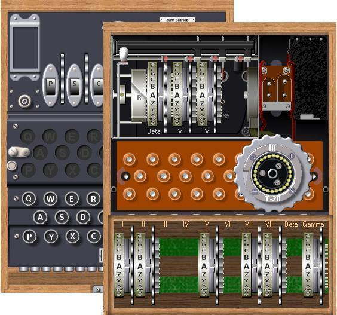



## \[ ENIGMA Real Version\]

### Description

This program is an exact simulation of the 3-rotor Army and famous 4-rotor Naval M4, used on U-boats, of the German Enigma cipher machine, as it was used during World War II from 1939 until 1945. You can select between the two models, choose different rotors or 'Walzen', preset the rotor wiring positions or 'Ringstellung' and switch letters by using plugs or 'Stecker'. The code is based on the technical details of the original machine. The internal wiring of all rotors is identical to those used by Wehrmacht, Luftwaffe and Kriegsmarine. Lots of research went into the design, working and handling, to provide a realistic and accurate simulation of all aspects of this crypto machine. It allows control and observation of all components. The simulator is therefor fully compatible with the real Enigma and you can decode original messages and encode your own text. The program includes a Smart Clipboard, Automatic Typing, a Helpfile containing the manual, the history of Enigma, several original messages and all technical details! There's also a picture gallery with authentic Enigma's and details of components. With this program you will finally be able to work with the most intriguing milestone in military cryptology and examine how it works and how it was operated. This is not one of many sims, available on the net, but a true reference to the Enigma machine! Well documented source code with lots of comments. All feedback and comments welcome. Program also available at

http://users.telenet.be/d.rijmenants/en/enigmasim.htm

*** New Update !!! 29 MAr 05, v4.0 ***
 
### More Info
 

             |
---                |---
**Submitted On**   |2005-03-29 19:56:36
**By**             |[D\. Rijmenants](https://github.com/Planet-Source-Code/PSCIndex/blob/master/ByAuthor/d-rijmenants.md)
**Level**          |Intermediate
**User Rating**    |4.9 (494 globes from 101 users)
**Compatibility**  |VB 5\.0, VB 6\.0
**Category**       |[Encryption](https://github.com/Planet-Source-Code/PSCIndex/blob/master/ByCategory/encryption__1-48.md)
**World**          |[Visual Basic](https://github.com/Planet-Source-Code/PSCIndex/blob/master/ByWorld/visual-basic.md)
**Archive File**   |[\[\_ENIGMA\_R1869373292005\.zip](https://github.com/Planet-Source-Code/d-rijmenants-enigma-real-version__1-56827/archive/master.zip)

